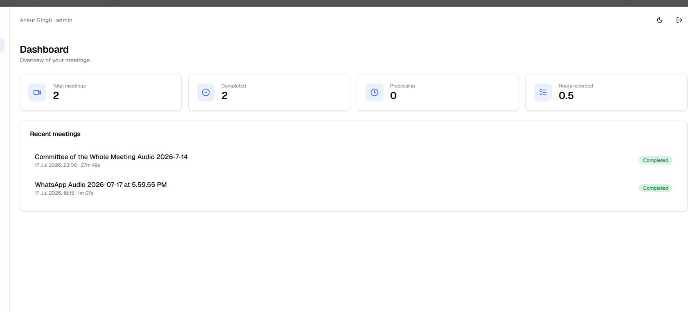
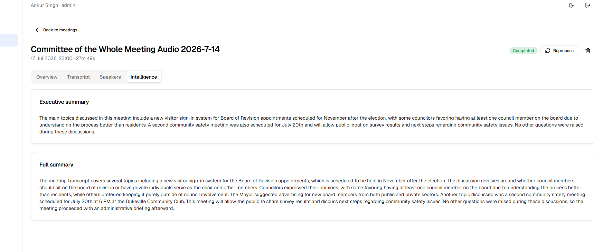
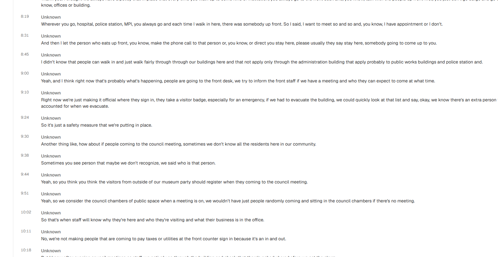
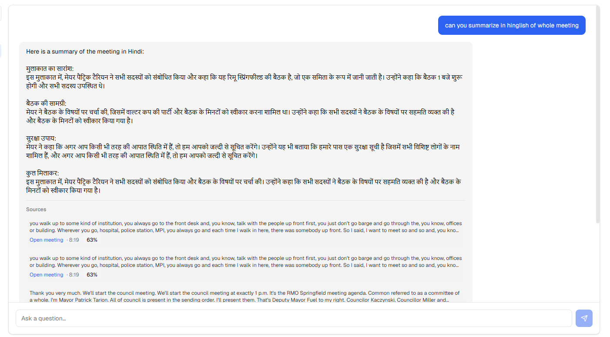

# 🎙️ AI Meeting Intelligence Platform

> Upload a meeting recording → get an automatic transcript, speaker labels,
> an AI summary with decisions & action items, and **chat with your meetings**
> using RAG. A full-stack, production-grade AI SaaS.


## ✨ Features

- **🎙️ Transcription** — speech → text with timestamps (OpenAI Whisper)
- **🗣️ Speaker diarization** — "who spoke when" (Pyannote), rename speakers
- **🧠 Meeting intelligence** — LLM-generated summary, decisions, risks, action items
- **🔍 Semantic search** — find moments across all meetings by meaning, not keywords
- **💬 RAG chat** — ask questions about your meetings, answers cite the exact moment
- **🔐 Auth & multi-tenancy** — JWT + refresh rotation, RBAC, per-org data isolation
- **📊 Dashboard** — stats, live processing status, dark mode

## 🏆 Engineering Highlights

What makes this more than a tutorial project:

- **Clean Architecture** — `api → services → repositories → models`; business logic
  is transport- and DB-agnostic and unit-tested without HTTP or a database.
- **Provider Pattern everywhere** — transcription, LLM, embeddings, vector store and
  file storage are all swappable via env vars (local ↔ OpenAI ↔ Ollama ↔ stub) with
  **zero code changes**. Stub providers let the whole AI pipeline run in CI for free.
- **Async pipeline** — long AI jobs run in Celery workers (not HTTP requests), with a
  status **state machine**, idempotent reprocessing, and `acks_late` reliability.
- **Security by design** — bcrypt, JWT refresh-token **rotation with reuse detection**,
  anti-enumeration, magic-byte file validation, fail-fast production secrets guard.
- **183 backend unit tests** + integration tests, ruff-linted, CI on GitHub Actions.
- **Fully dockerized** — one command spins up 6 services; separate dev & prod compose.

> 📄 **[Full build report & interview prep](docs/PROJECT_REPORT.html)** — a detailed
> walkthrough of all 12 build modules, the real bugs hit & fixed, and 30+ interview Q&A.
> (Open the HTML file in a browser.)

## 📸 Screenshots

**Dashboard** — meeting stats & recent activity


**Meeting Intelligence** — LLM-generated executive & full summary


**Transcript** — timestamped, speaker-attributed


**RAG Chat** — ask questions across meetings; answers cite the exact moment (here summarizing in Hinglish)


## Architecture (bird's-eye view)

```
Next.js (frontend)  ──REST/JWT──▶  FastAPI (backend)
                                      │  enqueue
                                      ▼
                         Celery workers (Redis broker)
                    FFmpeg → Whisper → Pyannote → LLM → Embeddings
                          │                        │
                     MinIO / S3               ChromaDB
                    (media files)            (vectors, RAG)
                                      │
                                 PostgreSQL
                        (users, meetings, transcripts,
                         insights, action items, chat)
```

Backend follows Clean Architecture: `api → services → repositories → models`,
with provider-pattern abstractions for storage, transcription, and LLMs
(swap OpenAI ↔ Ollama, local Whisper ↔ Whisper API via env vars only).

## Prerequisites

- [Docker Desktop](https://www.docker.com/products/docker-desktop/) (includes Docker Compose)
- Python 3.12+ (only for running tests / scripts on the host)

## Quickstart (development)

```bash
# 1. Configure environment
cp .env.example .env          # then edit values

# 2. Boot the backend + infra (Docker)
make up                       # or: docker compose --env-file .env -f docker/docker-compose.yml up -d --build

# 3. Start the frontend (host, hot reload)
cd frontend && npm install && npm run dev
```

Windows one-command startup: **`.\start.ps1`** (backend + frontend), stop with **`.\stop.ps1`**.

Open **http://localhost:3000**.

## Production (everything in Docker, frontend included)

```bash
make prod-up                  # docker compose -f docker/docker-compose.prod.yml up -d --build
```

See [docs/DEPLOYMENT.md](docs/DEPLOYMENT.md) for the full production guide.

## AI provider modes (all swappable via `.env`, no code changes)

| Concern | Free (local) | Paid (hosted) | Testing |
|---|---|---|---|
| Transcription | `local` (Whisper) | `openai` | `stub` |
| Summaries / chat | `ollama` | `openai` | `stub` |
| Embeddings | `local` (sentence-transformers) | — | `stub` |
| Speakers | Pyannote (needs `HF_TOKEN`) | — | `stub` |

| Service        | URL                                  |
| -------------- | ------------------------------------ |
| API            | http://localhost:8000                |
| Swagger docs   | http://localhost:8000/api/v1/docs    |
| Health (live)  | http://localhost:8000/api/v1/health  |
| Health (ready) | http://localhost:8000/api/v1/health/ready |
| MinIO console  | http://localhost:9001                |
| ChromaDB       | http://localhost:8001                |
| Frontend       | http://localhost:3000                |

## Development

```bash
# Backend unit tests (no infrastructure needed)
python -m venv .venv && .venv/Scripts/activate     # Windows
pip install -r backend/requirements-dev.txt
make test                     # or: python -m pytest tests/backend/unit -v

# Integration tests (stack must be up)
make test-integration

# Lint / format
make lint
make fmt
```

> **Windows note:** `make` works from Git Bash. From PowerShell, run the
> underlying commands in the [Makefile](Makefile) directly.

## Project layout

```
backend/            FastAPI app (Clean Architecture)
  app/core/         config, logging, database, exceptions, security
  app/api/v1/       HTTP endpoints (transport layer only)
  app/services/     business logic
  app/repositories/ data access (Repository Pattern)
  app/ai/           provider abstractions: whisper, pyannote, LLM, RAG
  app/workers/      Celery tasks (AI pipeline)
frontend/           Next.js App Router + ShadCN (Module 9+)
database/init/      Postgres extension bootstrap (schema lives in Alembic)
docker/             docker-compose stacks
scripts/            operational scripts (verify_stack, seed, create_admin)
tests/              unit + integration tests
docs/               architecture & API documentation
```

## Configuration

All configuration is environment-driven (12-factor). See
[.env.example](.env.example) for every knob, including:

- `LLM_PROVIDER` — `openai` (default) or `ollama`
- `TRANSCRIPTION_PROVIDER` — `local` (faster-whisper, free) or `openai`
- `HF_TOKEN` — leave empty to skip speaker diarization gracefully

Production refuses to boot with development default secrets (fail-fast guard
in `backend/app/core/config.py`).
